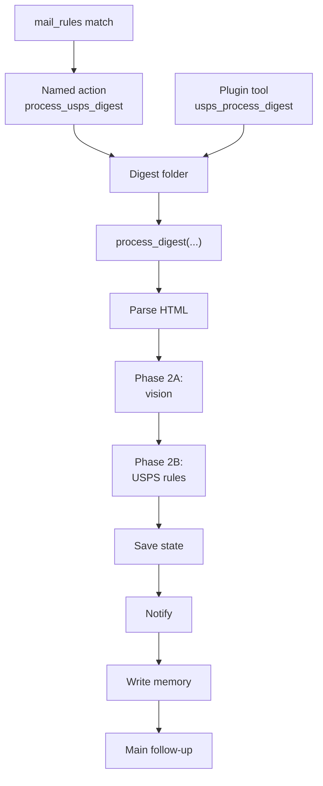

# 📮 USPS Mail Action — Architecture

> Deep internals for developers. For setup and usage, see [README.md](README.md).

---

## Module layout

| Module | Purpose |
|--------|---------|
| `register.ts` | Registers `process_usps_digest` with the 📬 [Carapace Mail Runtime](https://github.com/JeffSteinbok/carapace-mail-runtime) action registry |
| `analyze.ts` | Main orchestration pipeline for a single digest folder |
| `parse-digest.ts` | Parse the USPS HTML digest into structured mail metadata |
| `vision.ts` | Ask an OpenClaw agent to analyze each mailpiece image |
| `rules.ts` | User-managed importance rules stored in the workspace agent |
| `notify.ts` | Build and deliver recipient-specific notifications |
| `memory.ts` | Persist analysis history, workflow state, and monthly mail memory |
| `paths.ts` | Resolve workspace-owned USPS config/state locations |

---

## Two-phase processing

There are **two distinct processing phases** to keep straight:

1. **Mail-pipeline trigger phase** — top-level `mail_rules` decide that a message should run the `process_usps_digest` action at all
2. **USPS digest phase** — this package analyzes each scan image and then applies USPS-specific post-processing rules/config

### End-to-end flow



- **Phase 1** decides whether the incoming email is a USPS digest worth processing
- **Phase 2A** extracts structured facts from the scan images (vision agent)
- **Phase 2B** applies your personal USPS rules/config to those structured facts (workspace agent)

---

## Entry points

1. **Automatic mail pipeline:** `register.ts` registers `process_usps_digest` with the 📬 [Carapace Mail Runtime](https://github.com/JeffSteinbok/carapace-mail-runtime), which downloads digest artifacts, calls `process_digest(...)`, then hands a structured summary to another agent for any follow-up.
2. **Interactive/manual tooling:** [`plugins/usps-mail/src/tools.ts`](../../../plugins/usps-mail/src/tools.ts) exposes the same functions as OpenClaw tools (`usps_process_digest`, `usps_lookup`, `usps_rules`).

---

## Agent boundaries

The USPS runtime deliberately splits durable data and work across agents.

| Agent role | What it owns |
|-----------|---------------|
| `workspace_agent` | USPS config, rules, analysis history, workflow state, notification routing config |
| `vision_agent` | Temporary scan-image staging area and the actual vision analysis call |
| `memory_agent` | Long-term searchable markdown memory for processed mail |

### `workspace_agent`

`process_digest(...)` requires a `workspace_agent`. That workspace is the operational home for USPS processing:

- `workspace/usps-mail/rules.json` — classification rules
- `workspace/usps-mail/config.json` — notification routing config
- `workspace/memory/usps_analysis.json` — accumulated analysis history
- `workspace/memory/usps_state.json` — dedup / workflow state

This is usually the **mail agent** workspace, because the mail pipeline owns ongoing USPS operations.

### `vision_agent`

`vision.ts` copies each scan image into:

```
~/.openclaw/agents/<vision_agent>/workspace/camera_captures/
```

Then it invokes:

```
openclaw agent --agent <vision_agent> --json --message ...
```

The vision agent returns structured JSON for each mailpiece, and the staging image is deleted immediately afterward.

### `memory_agent`

`memory.ts` writes monthly markdown summaries under:

```
~/.openclaw/agents/<memory_agent>/workspace/memory/mail/
```

That long-term memory is meant for the agent that should remember mail over time, which is typically the **main agent** rather than the mail-processing workspace.

---

## Pipeline stages

For one digest folder, `process_digest(...)` runs:

1. Parse `body.html` and detect the delivery date.
2. Find scan images in the folder.
3. Analyze each image through the configured vision backend.
4. Apply user-managed importance rules.
5. Persist structured history in `usps_analysis.json`.
6. Write monthly mail memory markdown when enabled.
7. Build and send notifications based on routing config.
8. Update workflow state for dedup and last-processed tracking.

---

## Two rule systems, not one

| Layer | File | Purpose |
|------|------|---------|
| Mail pipeline trigger rules | `fastmail-sse-config.json` under `mail_rules` | Decide **when** to invoke the `process_usps_digest` action for an email |
| USPS classification rules | `workspace/usps-mail/rules.json` | Decide **how important** each analyzed mailpiece is after vision |

- `mail_rules` work at the **email/message** level
- USPS `rules.json` works at the **individual mailpiece image** level

---

## Notification routing

Notification routing config lives at `workspace/usps-mail/config.json`:

```json
{
  "routing": {
    "jeff": { "channel": "discord", "target": "<channel-id>" },
    "nicole": { "channel": "discord", "target": "<channel-id>" },
    "default": { "channel": "discord", "target": "<channel-id>" }
  }
}
```

`notify.ts` routes by addressee — mail addressed to specific people goes to their channel; everything else falls back to `default`. Only higher-priority pieces are notified directly; lower-priority items remain in history/memory.

---

## `process_digest(...)` runtime config

| Parameter | Purpose |
|----------|---------|
| `workspace_agent` | Required — owns USPS config, rules, history, and workflow state |
| `memory_agent` | Required when memory writing is enabled — owns long-term markdown memory |
| `vision_agent` | Required when `vision_backend` is `auto` — performs scan-image analysis |
| `vision_backend` | `auto`, `provided`, or `skip` |
| `persist_analysis` | Whether to write `usps_analysis.json` |
| `write_memory` | Whether to write monthly mail memory |
| `send_notifications` | Whether to deliver USPS notifications |
| `update_workflow_state` | Whether to update dedup / last-processed state |

---

## FastMail integration

When USPS processing runs from the FastMail mail pipeline:

```
fastmail-sse email event
→ mail runtime rule match
→ process_usps_digest action
→ mail_action_usps.process_digest(...)
```

After processing, `register.ts` creates an `agent_handoff` result with a structured JSON payload telling the downstream agent that vision, notifications, and memory have already been handled — only non-notification follow-up is still needed.

---

## Why this split exists

This package sits below both the service and plugin layers because USPS processing needs all of these properties at once:

- Reusable by multiple entry points
- Stateful across runs
- Agent-aware for vision and memory
- Separate from provider-specific mail ingestion

FastMail and the plugin stay thin adapters around this core.
